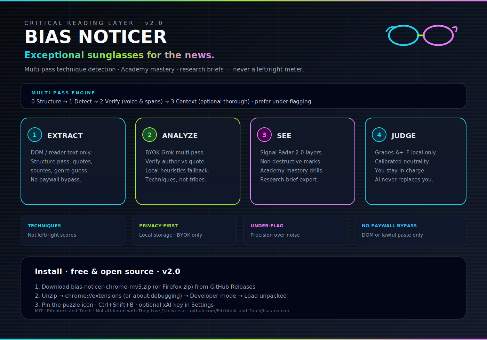
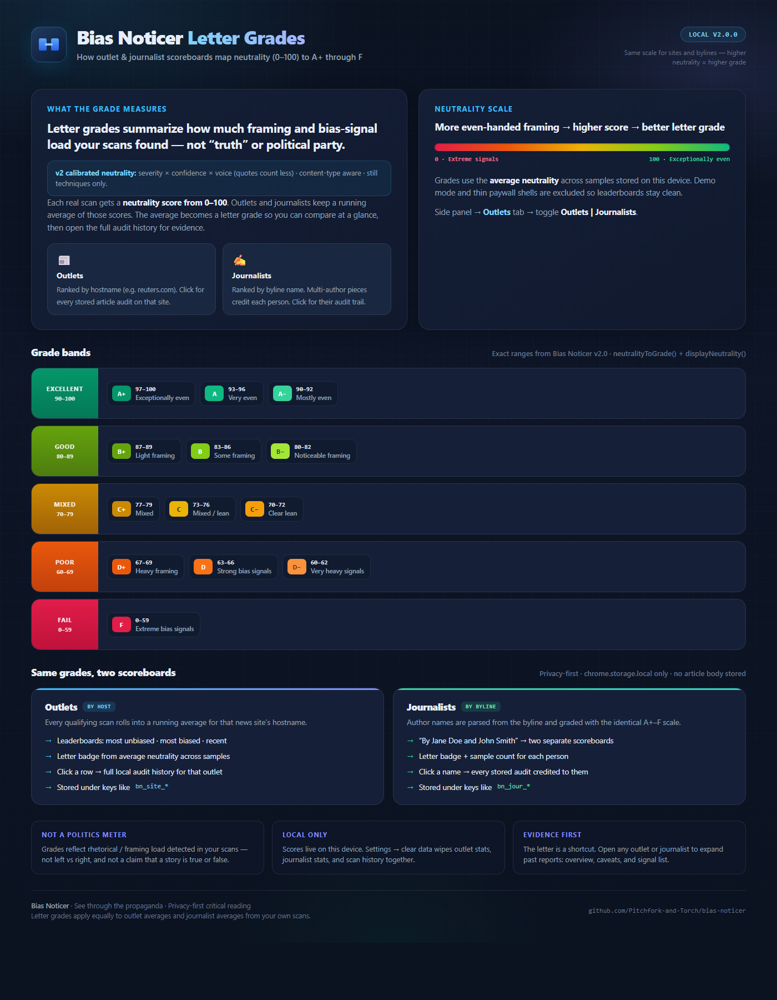

# Bias Noticer

**See through the propaganda.**


Privacy-first Chrome / Chromium extension that acts like critical-reading sunglasses: it highlights **rhetorical techniques** and framing choices in news and long-form writing — never censors a page, never sells your data, and never hands down a partisan “bias score.”

> AI-assisted analysis. Not infallible. Designed to augment critical thinking, not replace it.



---

## Why

Opaque left/right meters are a dead end. Bias Noticer names **techniques** instead:

- Loaded language · omission · cherry-picked stats · false dichotomies · and more  
- Directionally agnostic — same rules for every tribe  
- Tooltips + side panel with evidence, counterpoints, optional rephrases  
- **You** stay in control (sensitivity, categories, privacy, custom prompt)

Inspired by the *They Live* “put on the sunglasses” moment as a metaphor for media literacy — **not** affiliated with the film or its rights holders.

---

## Features (v2.0)

| | |
|---|---|
| **Multi-pass shades** | Structure → detect → verify → optional missing-context (BYOK Grok or local heuristics) |
| **Signal Radar 2.0** | Severity layers, scrub reveal, tooltips with why / rephrase / voice |
| **Technique Academy 2.0** | Adaptive drills, mastery + streaks, live spot-the-technique · local progress |
| **Side panel** | Detected · Summary · Evidence · Research · **Outlets** · **Academy** · Feedback |
| **Letter grades** | Calibrated neutrality 0–100 → **A+…F** (severity × confidence × voice) |
| **Outlet scoreboard** | Running averages by hostname · sparklines · clickable audit history |
| **Journalist scoreboard** | Same grades by byline · multi-author split · local scan timelines |
| **Research brief** | Premium Markdown / print export with evidence table + methodology note |
| **Reader extract** | Reformats text **already in the page DOM** (`Alt+R`) — not a paywall crack |
| **Research paste** | Lawful full-text audit path (works without a prior scan) |
| **Local calibration** | Mark flags wrong / too strong — thresholds adjust on-device only |
| **Themes** | Light / Dark / System / They Live retro |
| **Privacy** | Key stays in `chrome.storage.local` · optional cache · clear-all-data |
| **Default model** | `grok-4.3` (configurable) |
| **Firefox** | `npm run build:firefox` / `npm run zip:firefox` |

---

## Letter grades

Grades summarize **framing / bias-signal load** from *your* scans — not “truth,” not left vs right.



| Grade | Neutrality | Meaning |
|-------|------------|---------|
| **A+** | 97–100 | Exceptionally even |
| **A** | 93–96 | Very even |
| **A−** | 90–92 | Mostly even |
| **B+** | 87–89 | Light framing |
| **B** | 83–86 | Some framing |
| **B−** | 80–82 | Noticeable framing |
| **C+** | 77–79 | Mixed |
| **C** | 73–76 | Mixed / lean |
| **C−** | 70–72 | Clear lean |
| **D+** | 67–69 | Heavy framing |
| **D** | 63–66 | Strong bias signals |
| **D−** | 60–62 | Very heavy signals |
| **F** | 0–59 | Extreme bias signals |

**Outlets** roll by hostname (`bn_site_*`). **Journalists** roll by byline name (`bn_jour_*`).  
Demo mode and thin paywall shells are excluded from rankings. Click any row in the side panel for full local audit history (compact report — no article body stored).

Source HTML for the poster: [`docs/assets/infographic-letter-grades.html`](docs/assets/infographic-letter-grades.html).

---

## Install (Chrome / Brave / Edge)

### From GitHub Release (recommended)

1. Open the latest [**Release**](https://github.com/Pitchfork-and-Torch/bias-noticer/releases) and download **`bias-noticer-chrome-mv3.zip`**.
2. Unzip to a permanent folder (Chrome needs the folder to stay put).
3. Go to `chrome://extensions` (or `brave://extensions` / `edge://extensions`).
4. Enable **Developer mode**.
5. Click **Load unpacked** → select the unzipped folder (the one that contains `manifest.json`).
6. Pin **Bias Noticer** from the puzzle menu.
7. Open Settings in the extension → paste your [xAI](https://console.x.ai/) API key (optional; heuristics work offline).

### From source

```bash
git clone https://github.com/Pitchfork-and-Torch/bias-noticer.git
cd bias-noticer
npm install
npm run build
```

Load unpacked from `.output/chrome-mv3`.

### Shortcuts

| Keys | Action |
|------|--------|
| `Ctrl+Shift+B` | Put on / take off shades |
| `Ctrl+Shift+Y` | Open side panel (also: popup → **Panel**) |
| `Alt+[` / `Alt+]` | Previous / next signal |
| `Alt+R` | Local reader extract |

---

## Ethics

- Does **not** bypass paywalls or fetch paid content for you.  
- Reader / paste paths only use text **you already have access to**.  
- Support journalism you value.  

---

## Development

```bash
npm install
npm run dev      # WXT + HMR
npm run build    # production MV3
npm run compile  # tsc --noEmit
npm run zip      # packaged zip via WXT
```

Stack: **WXT · TypeScript · React · Tailwind · Mozilla Readability**.

Key modules: `lib/grades.ts` (letter scale), `lib/site-cache.ts` (outlet + journalist scoreboards), `lib/signal-radar.ts` + `components/SignalRadar.tsx` (document heat map), `lib/academy.ts` + `components/TechniqueAcademy.tsx` (lessons & drills), `entrypoints/sidepanel/` (main UX).

---

## Support the work

Bias Noticer is **free and open source**. Bug reports and feature requests are welcome via [GitHub Issues](https://github.com/Pitchfork-and-Torch/bias-noticer/issues).

---

## License

MIT — see [LICENSE](LICENSE).
